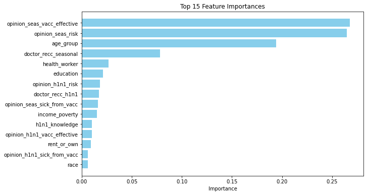
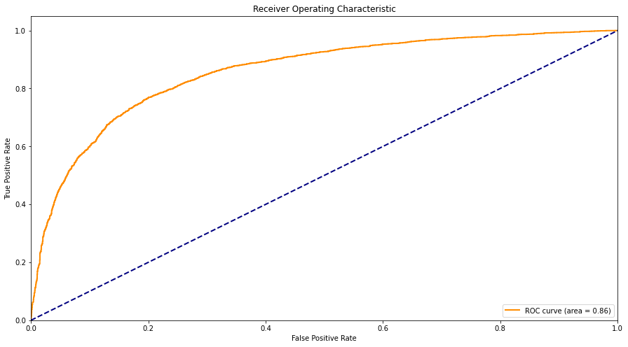
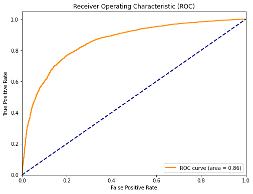
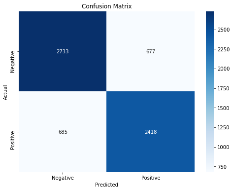
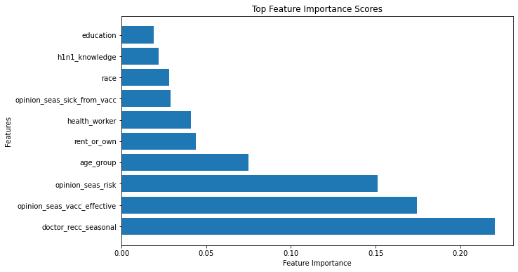

# dsc-phase-3-project

## Project Overview
The National Center for Immunization and Respiratory Diseases (NCIRD) sponsored the National 2009 H1N1 Flu Survey (NHFS), which was carried out by NCIRD and the National Center for Health Statistics (NCHS), both of the Centers for Disease Control and Prevention (CDC). The National Household Flu Survey (NHFS) was a list-assisted random-digit-dialing telephone survey of households conducted in 2009–2010 to track influenza vaccine coverage.

When the American government launched a vaccination campaign in October 2009, H1N1 vaccines became widely accessible nationwide. I'll examine the information from the National 2009 H1N1 Flu Survey, which was conducted to track vaccination rates during that campaign. Along with questions about their lifestyles, beliefs, and activities, this phone survey asked whether they had gotten the H1N1 and seasonal flu vaccines. Future public health initiatives may receive guidance from greater knowledge of how these traits have been linked to individual vaccination habits.

In this analysis, the focus is on leveraging data-driven insights to design personalized vaccination campaigns. The goal is to employ predictive models to identify individuals at a higher risk of not receiving these vaccines and tailor interventions to address their specific concerns or barriers. By doing so, public health organizations can maximize the impact of their vaccination efforts, improve community health, and better prepare for future influenza outbreaks.

## Business Understanding
The business problem in this context is to understand the factors and characteristics that influence individual vaccination habits, specifically regarding the H1N1 and seasonal flu vaccines. The data from the National 2009 H1N1 Flu Survey (NHFS) provides valuable insights into these vaccination rates during the 2009 campaign.

 How can healthcare providers and public health organizations use predictive modeling to create individualized vaccination promotion programs for people throughout flu seasons, taking into account variables like way of life, attitudes, and activities? The objective is to increase the vaccination rates for both the H1N1 and seasonal flu vaccines.

## Data Understanding
Our dataset contains information about the respondents, such as their level of concern about the H1N1 virus, knowledge about H1N1, behavioral habits, and demographic details. This data conatains two target variables, that is, h1n1_vaccine and seasonal_vaccine which are dependent variable to help us see which of the other columns affect them the most.

## Modeling
### Decision Tree
Decision Tree operates by making decisions at each internal node of the tree and recursively dividing the dataset into subsets according to the values of input features. The end result is a structure that resembles a tree, with the class labels represented by its leaves.

### Logistic Regresion
Logistic Regression analysis of this kind uses a binary dependent variable. Based on the values of the independent variables, logistic regression seeks to calculate the likelihood that a given instance belongs to a certain class.

### Random Forest
Random Forest is a machine learning algorithm that uses a bagging technique. It is a development of the decision tree algorithm that makes predictions by combining different decision trees. As a result, the Random Forest algorithm's model predicts the outcome based on the votes of the majority of all the decision trees in the forest, reducing overfitting. The robustness and versatility of random forests in handling large, complicated datasets are well known.

### XGBoost
The final algorithm used is Gradient Boosting (XGBoost). In this case, the algorithm uses an ensemble of weak decision trees. The algorithm uses gradient descent to minimize the loss function of the model, concentrates on where the model went wrong, and creates new learners. XGBoost has been found to outperform Random Forests in many instances.

## Conclusion
All three models (Logistic Regression, Random Forest, and XGBoost) achieved reasonably good accuracy, precision, and recall scores. These scores indicate that the models are generally effective at making binary classification predictions. A comparison of multiple classifiers, including Logistic Regression, Random Forest, Decision Tree, and XGBoost, was conducted. As observed that XGBoost had the highest accuracy and balanced precision and recall, making it a strong performer in this binary classification task.
This analysis shows that it is possible with 77% sensitivity (recall) predict whether a person will be vaccinated or not. This model can help improve vaccination rates when used in the right settings.

## Recommendation
In a medical facility, it is possible to identify these various groups: expected vaccinated and predicted unvaccinated. Patients are asked to complete a survey before seeing a doctor so that the doctor's office can determine if the patient is expected to get vaccinated or not. The information derived from the feature's importance and concerns addressed to healthcare professionals would be delivered to those who were expected to be unvaccinated.
Create a dashboard that includes the model's suggestions and a prediction of whether a patient will receive a vaccination. Create persuasive information for healthcare professionals to tell their patients about the risk of the seasonal flu and the H1N1 flu.
The XGBoost model displays promise in predicting vaccine uptake with considerations for improving precision and recall while socioeconomic and demographic factors play significant roles.